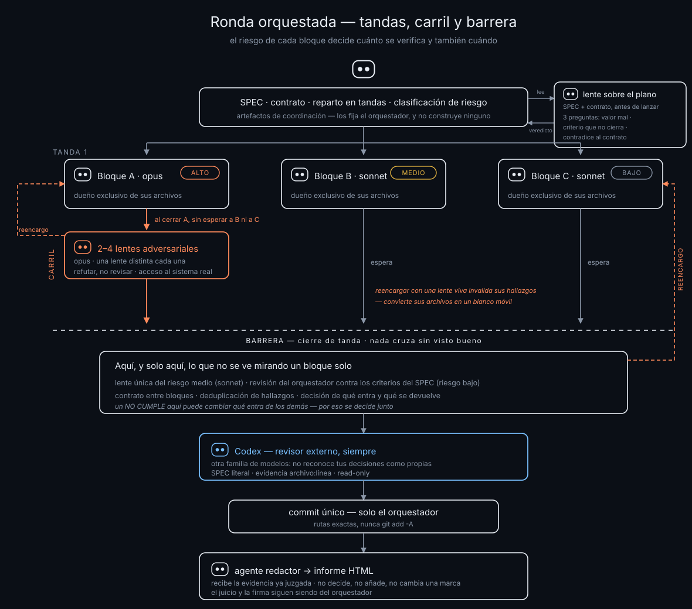

# EL-ORQUESTADOR

[](https://github.com/padremprendedor-create/EL-ORQUESTADOR/actions/workflows/ci.yml)   

**El plano antes del martillo.** Un plugin de [Claude Code](https://claude.com/claude-code) —cuatro skills y dos agentes— para construir con agentes de IA sin que el resultado salga correcto y aun así inútil.

La IA optimiza lo que le pediste, no lo que querías. Y un agente que reporta `"status": "completado"` te está dando su opinión, no una prueba. Este plugin cierra esos dos huecos: escribes qué significa «terminado» **antes** de construir, y lo contrasta alguien que no fue quien construyó.

---

## Qué hay dentro

| Skill | Qué hace | Cuándo se dispara |
|---|---|---|
| **`spec`** | Convierte una idea en un `SPEC.md` con criterios que se contestan **sí o no**. El objetivo real de negocio, qué queda fuera, y qué acciones requieren permiso humano. | Al empezar cualquier construcción de varios pasos |
| **`orquestador`** | Reparte el trabajo en bloques con **dueño exclusivo de archivos**, lanza agentes en paralelo, verifica por riesgo —y **en carril**, sin esperar, lo que de verdad duele— y hace **un solo commit** que documenta la ronda entera. | Cuando el trabajo se parte en 3+ frentes, o toca base de datos, autenticación, dinero o producción |
| **`verificar-spec`** | Verificación **adversarial**: intenta demostrar que NO cumple, criterio por criterio y con evidencia `archivo:línea`. Devuelve `CUMPLE` / `NO CUMPLE` / `NO VERIFICABLE`. | Antes de integrar o commitear, o cuando un agente dice «completado» y nadie lo contrastó |
| **`codex`** | Invoca el CLI de [Codex](https://developers.openai.com/codex/cli) como segundo par de ojos. Otra familia de modelos: no reconoce tus decisiones y por eso no las lee como correctas. | Al cerrar una ronda, o cuando pidas una segunda opinión que no comparta tus sesgos |

Las cuatro se usan juntas, pero `spec` y `verificar-spec` funcionan solas si lo único que quieres es dejar de entregar a ciegas.

Y **dos agentes**, que son el trabajo que se repite en cada ronda:

| Agente | Qué es |
|---|---|
| **`bloque-constructor`** | Construye **un** bloque respetando la propiedad exclusiva de archivos. Lleva dentro los comandos que no puede correr en paralelo, «nunca commitees ni pushees», «producción es solo lectura» y el formato de reporte |
| **`lente-adversarial`** | No construye: intenta **demostrar que un bloque está roto**. Lleva dentro «refutar, no revisar», reproducir contra el sistema real en vez de razonar sobre el código, y no volcar secretos en su reporte |

Que sean agentes y no párrafos de un brief tiene una consecuencia que importa: **sus reglas se aplican tanto si quien orquesta se acordó de pegarlas como si no.**

---

## Cómo se ve una ronda



Tres ideas que el dibujo cuenta mejor que un párrafo:

- **La propiedad exclusiva de archivos es lo que hace posible todo lo demás.** Un bloque = un dueño. Sin eso, verificar un bloque mientras otro escribe debajo es verificar un blanco móvil.
- **El riesgo decide cuánto se verifica y también cuándo.** Lo que puede exponer un dato, dejar a alguien fuera o equivocar un importe se refuta **en carril**, en cuanto ese bloque cierra. Lo demás espera a la barrera. Las mismas lentes, antes — y el defecto grave aparece mientras aún se puede reencargar sin deshacer lo que otros construyeron encima.
- **La barrera no desaparece.** Hay defectos que solo existen **entre** bloques: una firma que nadie respetó, el mismo hallazgo contado tres veces, un `NO CUMPLE` que cambia qué entra de los demás. Eso solo se ve con todo delante.

---

## La regla que lo sostiene todo

> **Quien construye no verifica, y se verifica contra los criterios del SPEC — nunca contra el `status` que el agente se puso.**

Todo lo demás (el reparto en bloques, las lentes adversariales, el contrato de la ronda) es aparato que puedes recortar cuando el trabajo es pequeño. Esa frase, no.

Las otras tres barreras, por si recortas de más:

- **Los agentes escriben archivos y reportan. Solo el orquestador commitea y pushea.** Git es secuencial: tres agentes pusheando en paralelo es merge hell.
- **Un archivo tiene un solo dueño por ronda.** Si dos bloques necesitan escribirlo, se produce antes, en una tanda preparatoria, con su propio agente.
- **Ningún SQL se aplica sin verificación externa previa.** Sin ella, no se aplica: se propone.

---

## Requisitos

No hay nada que compilar ni que instalar: son **archivos markdown** que Claude Code lee. Pesan 100 KB en total.

| | |
|---|---|
| **Imprescindible** | [Claude Code](https://claude.com/claude-code) — CLI, app de escritorio o extensión del IDE, da igual |
| **Sistema** | Cualquiera donde corra Claude Code: Windows, macOS o Linux |
| **Disco** | 100 KB |
| **Para la skill `codex`** | El [CLI de Codex](https://developers.openai.com/codex/cli) y una cuenta de OpenAI. Sin él, las otras tres funcionan igual: te saltas el paso 7 |
| **Para el `orquestador`** | Que tu Claude Code pueda lanzar subagentes, y **presupuesto de tokens** — ver [Lo que esto cuesta](#lo-que-esto-cuesta) |

**Lo que de verdad limita aquí no es la máquina, son los tokens.** El orquestador lanza agentes en paralelo y una ronda grande se come millones de tokens; el paso 1 de la skill existe justo para decidir si compensa antes de gastarlos.

> **El proyecto está escrito en español.** Las cuatro skills, sus plantillas y este README. Claude Code funciona igual en cualquier idioma, pero si no lees español vas a clonar 100 KB que no te sirven — mejor saberlo antes.

---

## Instalación

Desde Claude Code, dos comandos:

```
/plugin marketplace add padremprendedor-create/EL-ORQUESTADOR
/plugin install el-orquestador@el-orquestador
```

El plugin y el marketplace se llaman igual: este repo publica un solo plugin. Luego pídele *"escribe el SPEC de esto"* o *"orquesta esto"*.

> **Los agentes llevan el prefijo del plugin.** Instalado así son `el-orquestador:bloque-constructor` y `el-orquestador:lente-adversarial`; copiados a mano (abajo), van a secas. Si ves `Agent type not found`, eso es lo primero que mirar — y lo segundo, reiniciar la sesión: **el registro de agentes se carga al arrancar**, así que uno recién instalado no aparece hasta la siguiente.

### A mano, sin el gestor de plugins

```bash
git clone https://github.com/padremprendedor-create/EL-ORQUESTADOR.git
cp -r EL-ORQUESTADOR/plugins/el-orquestador/skills/* ~/.claude/skills/
cp -r EL-ORQUESTADOR/plugins/el-orquestador/agents/* ~/.claude/agents/
```

Si una skill no aparece, comprueba que su carpeta se llama igual que el campo `name` de su `SKILL.md`: cuando no coinciden, **Claude Code no la encuentra y no avisa**. `node scripts/check-skills.mjs` lo comprueba por ti, junto con los manifiestos y los agentes.

### Si vas a usar la skill `codex`

Necesita el [CLI de Codex](https://developers.openai.com/codex/cli) instalado **y dos perfiles** que no vienen de fábrica. Están en `plugins/el-orquestador/codex/`:

```bash
cp EL-ORQUESTADOR/plugins/el-orquestador/codex/revisor.config.toml     ~/.codex/
cp EL-ORQUESTADOR/plugins/el-orquestador/codex/constructor.config.toml ~/.codex/
cp EL-ORQUESTADOR/plugins/el-orquestador/codex/AGENTS.md               ~/.codex/AGENTS.md   # ojo si ya tienes uno
```

- **`revisor`** — `sandbox_mode = "read-only"`. Es el perfil por defecto: no puede escribir nada.
- **`constructor`** — `workspace-write` sin red, para implementar dentro de un worktree ya asignado.

> **Esto no es opcional, es seguridad.** Un perfil mal escrito **se ignora en silencio** y la corrida cae a `workspace-write`: creerías estar en solo-lectura y no lo estarías. Comprueba que carga antes de confiar en él:
>
> ```bash
> codex exec -p revisor "di solo: perfil ok" </dev/null
> ```

`AGENTS.md` es lo que Codex lee en cada sesión y contiene la regla dura de que nunca toca GitHub. Si ya tienes uno propio, **no lo sobrescribas**: fusiona a mano las secciones que te sirvan.

---

## Qué NO incluye

Las skills se mencionan entre sí donde ayudan. Estas se nombran pero **no vienen aquí**, y el método funciona sin ellas:

- `diseno` y `ui-ux-pro-max` — cuando la ronda toca interfaz
- `artifact-design` — para el informe HTML del paso 8 del orquestador (es una skill del arnés de Claude Code, no un archivo)
- El pack `audit-*` — para «¿qué se rompe en producción?», que es otra pregunta distinta de «¿esto cumplió lo que prometió?»

Si una skill te manda a algo que no tienes, sáltate ese paso: ninguno de los tres es un eslabón obligatorio.

---

## Lo que esto cuesta

El orquestador trae un presupuesto medido de una ronda real —6 bloques, 10 500 líneas, 54 archivos— para que puedas decidir si te compensa antes de arrancar:

| | |
|---|---|
| Tokens de subagente | 2 320 106 |
| De eso, verificación | 734 535 — **31,7 %** |
| Cómputo de agentes | 2 h 44 · camino crítico ≈ 1 h 30 |
| Reloj de la sesión | ≈ 4 h 20 |
| Defectos confirmados | 14, todos con reproducción |

**El aparato no es gratis y no siempre compensa.** El paso 1 del orquestador existe justo para eso: medir antes de gastar, y decir en voz alta por qué eliges la vía corta cuando la eliges. Para un formulario, montar la ronda entera quema tokens; para una migración, saltársela quema producción.

Fíjate en la distancia entre el cómputo de los agentes (2 h 44) y el reloj (4 h 20): **el cuello de botella no eran los agentes, era esperarlos**. De ahí sale el carril — no ahorra un solo token, pero devuelve buena parte de ese hueco y adelanta el hallazgo grave a cuando todavía es barato arreglarlo.

---

## Cómo usar esto en tu proyecto

Estas skills asumen que las reglas duras viven también en tu `CLAUDE.md` global — ellas solo las operacionalizan. Lo mínimo que conviene copiar allí:

```markdown
# Spec-Driven — el plano antes del martillo
Ningún trabajo de construcción de varios pasos arranca sin SPEC.md con criterios
verificables sí/no, ni se integra sin contrastarlos.
La prueba: ¿alguien podría entregar esto, reportar "completado", y estar
equivocado sin que nadie lo note? Si sí, hay SPEC.

# Agentes en paralelo + Revisor Central
Los agentes NUNCA pushean: escriben archivos y devuelven su reporte. Un único
Revisor Central recopila, resuelve conflictos y hace un solo commit.
Al verificar: contra los criterios del SPEC, NUNCA contra el `status` que el
agente se puso.
```

Si tu proyecto tiene rondas con agentes fijos, canales propios o un vault, deriva tu propia skill de orquestación. **Lo que se deriva es el aparato —qué agentes, qué canales, qué vault—, nunca la doctrina.**

---

## Antes de instalarlo, dos cosas

Seguir estas skills hace que un agente lance subagentes, reescriba archivos, aplique migraciones y commitee. Los frenos son reglas escritas, no candados técnicos, y hay **un fallo silencioso que conviene comprobar a mano**: un perfil de Codex mal escrito no da error, se ignora, y la corrida cae a modo escritura cuando creías estar en solo lectura. Todo eso, con lo que hay que comprobar, está en **[SECURITY.md](SECURITY.md)**.

Y si vas a proponer un cambio: **[CONTRIBUTING.md](CONTRIBUTING.md)** dice qué se acepta, qué no, y cuál es la única frase del método que no se toca.

---

## Licencia

[MIT](LICENSE). Clónalo, ábrelo por dentro, cámbialo y úsalo en tu trabajo, incluso cobrando por ese trabajo. Solo conserva el aviso de copyright.

Si lo mejoras, un PR se agradece — pero no hace falta pedir permiso para nada.

---

Sale de la comunidad **[iapatodos](https://iapatodos.com)**, donde se aprende a construir con IA sin programar. Está en [La Bóveda](https://iapatodos.com/boveda), con el resto de lo que regalamos.
